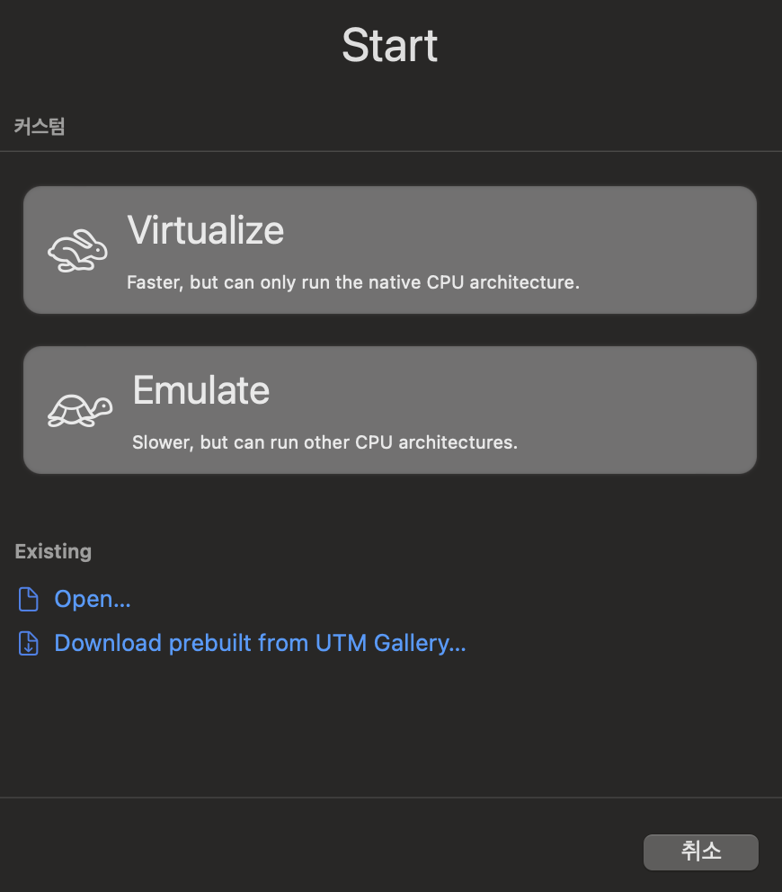
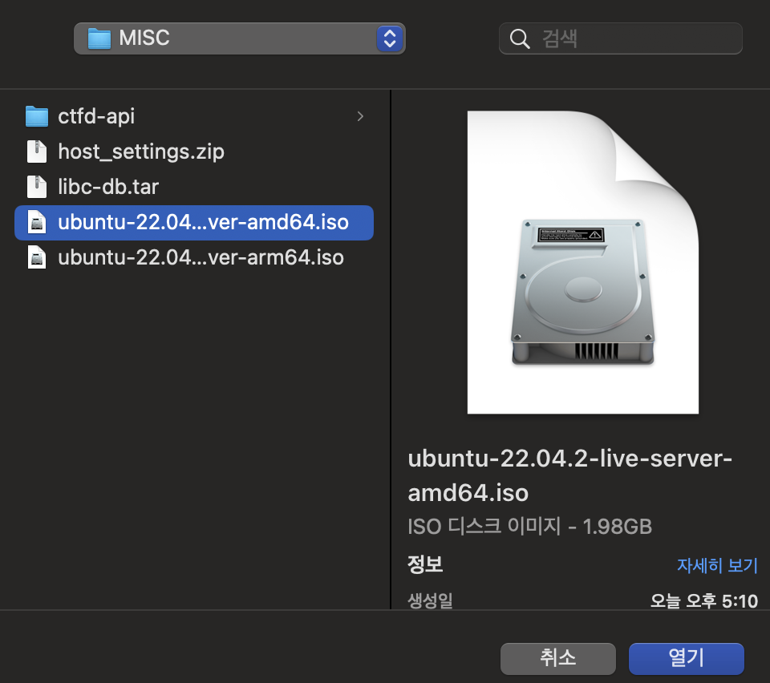
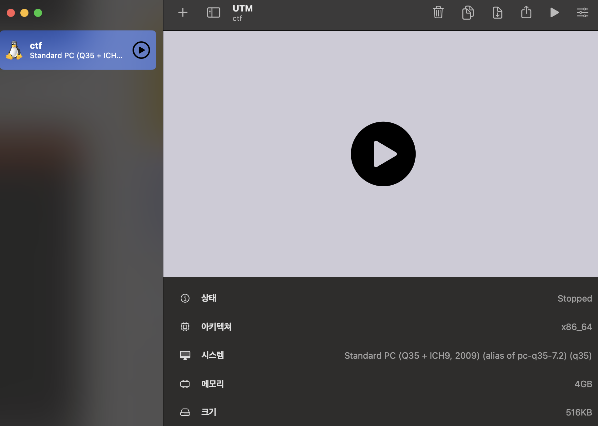

## Why?

> 많은 보안인들이 알고 있듯이 Apple Silicon은 포너블을 하기에 참 적합하지가 않다. 업무를 보다보면 필히 x86 바이너리를 다뤄야 하는데, Apple Silicon은 ARM 구조를 사용하고 있기 때문에 제약이 생긴다. 이에 대한 해결 방안으로 amd64 ubuntu 도커를 받고 여기에 분석 도구를 세팅하는 사용자가 많다. 하지만 이 방법은 pwndbg가 동작하지 않는 등 아직까지는 완전히 amd64를 대체할 만한 수단은 아닌 것 같다. 이 때문에 조금 무겁더라도 UTM을 이용하여 amd64 ubuntu 환경을 구축하고자 한다.

---

## UTM 설치

- UTM은 QEMU 기반의 에뮬레이터이다. iOS, MacOS 에서 다른 OS를 full system emulation 할 수 있다.

- 설치는 [깃허브](https://github.com/utmapp/UTM) 에서 UTM.dmg를 받아서 진행할 수 있다.

- 설치 후에는 아래와 같은 화면을 볼 수 있다.

{: width="40%" height="40%"}

---

## 새 가상머신 만들기

- 본 글에서는 Ubuntu 22.04 Server(CLI)를 설치할 것이다.

1. Ubuntu 22.04의 iso 파일을 다운로드 받으면 된다. AMD64로 받아주면 된다. ([다운로드](https://releases.ubuntu.com/jammy/))
2. UTM에서 "새 가상머신 만들기" 를 선택하면 `Virtualize`와 `Emulate` 두가지 옵션이 있다. Virtualize는 Parallels, VMWare와 같이 가상머신을 가상화 하는것으로, 호스트의 CPU 아키텍처만 사용할 수 있다. 이와 반대로 Emulate는 네이티브 CPU 아키텍처가 아닌 다른 것들을 사용할 수 있다. 그 대신 CPU 그 자체를 에뮬레이팅 하는 것이기 때문에 속도가 느릴 수 있다. 본 글의 경우 느리더라도 amd64를 네이티브 처럼 사용하는 것이 목적이기 때문에 Emulate를 선택한다.

{: width="40%" height="40%"}

3. 그 다음으로 운영체제는 Linux를 선택한다. 그 다음 화면에서 "탐색" 을 눌러 방금 다운로드 받은 ISO 파일의 경로를 선택해준다.

{: width="40%" height="40%"}

{: width="40%" height="40%"}

{: width="40%" height="40%"}

4. 아키텍처와 메모리, CPU 코어 수를 선택해준다. 아키텍처는 x86_64로 하고, 메모리와 CPU는 본인 사양을 고려하여 적절히 조절한다. 저장 공간도 마찬가지이다.

{: width="40%" height="40%"}

{: width="40%" height="40%"}

5. 공유 폴더는 선택사항이나, 본 글에서는 `~/utm` 디렉토리를 만들고 공유 폴더로 지정하였다. 바이너리를 옮기거나 할때 일일히 SCP를 쓴다거나 하면 불편하기 때문에 웬만하면 설정해주자.

{: width="40%" height="40%"}

{: width="40%" height="40%"}

6. 가상 머신 이름을 설정해준다.

{: width="40%" height="40%"}

7. 최종적으로 다음과 같은 화면이 나오게 되는데, 이 이후는 그냥 Ubuntu 설치하듯이 설치하면 된다.

{: width="40%" height="40%"}

{: width="40%" height="40%"}

8. 설치가 완료되면 CD/DVD를 초기화 한 후 실행한다. 익숙한 Ubuntu를 확인할 수 있다. SSH 등 편한 방법으로 접근하여 사용하면 된다.

{: width="40%" height="40%"}

{: width="40%" height="40%"}

9. 아키텍처를 확인해보면 `x86_64`인 것을 알 수 있다.

{: width="40%" height="40%"}

---

## 제약 사항이 있는지 확인해보기

- 다른 가상화 프로그램을 이용하면 pwndbg가 되지 않았는데, 정상적으로 동작하고 x86 바이너리도 잘 실행 되는 것을 확인할 수 있다.

{: width="40%" height="40%"}

## Ref.

https://dev.to/ruanbekker/how-to-run-a-amd64-bit-linux-vm-on-a-mac-m1-51cp